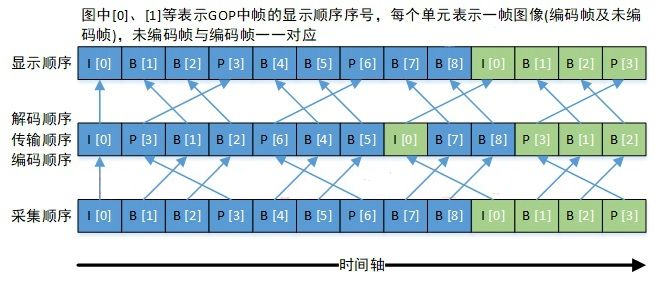
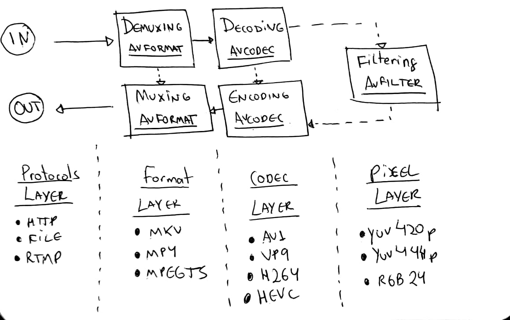

### ffmpeg命令
```shell
ffmpeg的命令主要分为5个部分
$ ffmpeg \
-y \ # global options
-c:a libfdk_aac \ # input options
-i bunny_1080p_60fps.mp4 \ # input url
-c:v libvpx-vp9 -c:a libvorbis \ # output options
bunny_1080p_60fps_vp9.webm # output url
```


### ffmpeg的大概工作流程？
AVFormatContext 加载媒体，读取部分头部信息
读取头部信息之后就可以获得媒体流了，大概分为视频流和音频流
随后AVStream可以访问这些流
访问流之后可以使用AVPacket访问提取流里面的片段（packets?，pieces？.uncompressed frame）
提取的片段依然是压缩的，使用特定的AVCodec去解压缩这些packets
AVCode会把压缩的数据解压到AVFrame里面，得到未压缩的Frame


### timestamp



DTS(Decoding Time Stamp, 解码时间戳)，表示压缩帧的解码时间。
PTS(Presentation Time Stamp, 显示时间戳)，表示将压缩帧解码后得到的原始帧的显示时间。
音频中 DTS 和 PTS 是相同的。视频中由于 B 帧需要双向预测，B 帧依赖于其前和其后的帧，因此含 B 帧的视频解码顺序与显示顺序不同，即 DTS 与 PTS 不同。当然，不含 B 帧的视频，其 DTS 和 PTS 是相同的。下图以一个开放式 GOP 示意图为例，说明视频流的解码顺序和显示顺序

### ffmpeg的工作流程



### AVFormatContext * input_context 可以表示一个视频的信息
```c
avformat_open_input(&input_context,file,NULL,NULL);//打开文件读取部分的信息
if (avformat_find_stream_info(input_context, NULL) < 0) // 把流里面的信息填入AVFormat_context里面的stream里面
```
###  编解码器和参数
```c 
AVCodec *pCodec = NULL;                  // 编解码器
AVCodecParameters *pCodec_params = NULL; // 编解码器参数

for (int i = 0; i < input_context->nb_streams; ++i)
    {
        AVCodecParameters *pLocalParams = NULL;
        pLocalParams = input_context->streams[i]->codecpar;
        AVCodec *pLocalCodec = NULL;
        pLocalCodec = avcodec_find_decoder(pLocalParams->codec_id);
        if (pLocalCodec == NULL)
        {
            // logging("error find decoder codec");
            // return -3;
            continue;
        }
        if (pLocalParams->codec_type == AVMEDIA_TYPE_VIDEO)
        {
            if (video_stream_index == -1)
            {
                video_stream_index = i;
                pCodec_params = pLocalParams;
                pCodec = pLocalCodec;
            }
        }
        logging(pLocalCodec->name, pLocalCodec->id, pLocalParams->bit_rate);
    }
```

```c
pLocalParams = input_context->streams[i]->codecpar;//就是寻找参数

//感觉这个注册的编解码器就是一个全局的编解码器，也可能不是，因为后面会使用
pLocalCodec = avcodec_find_decoder(pLocalParams->codec_id);

//参数带有编解码器，然后初始化编解码器参数
if (avcodec_open2(pAVCodec_context, pCodec, NULL) < 0)
pAVCodec_context

//申请编解码器的参数
AVCodecContext *pAVCodec_context = NULL;
pAVCodec_context = avcodec_alloc_context3(pCodec);

//把原来视频里面的编解码器参数传入到申请的编解码器参数里面
if (avcodec_parameters_to_context(pAVCodec_context, pCodec_params) < 0) // 初始化codec_context参数来去使用之前给定的codec
    
//初始化参数来使用之前寻找到的编解码器
if (avcodec_open2(pAVCodec_context, pCodec, NULL) < 0)

//后面就是发送和接受数据了
AVFrame *pFrame = av_frame_alloc();
AVPacket *pPacket = av_packet_alloc();
```

```c
while (av_read_frame(input_context, packet) >= 0) // read_frame从input里面读取frame
    {
        if (packet->stream_index == video_stream_index) // 读取这个包。看一下是不是视频的包,是的话就进行处理
        {
            response = avcodec_send_packet(pAVCodec_context, packet);
            if (response < 0)
            {
                break;
            }
            // 下面就是表示后面一个函数的返回值了
            while (response >= 0)
            {
                response = avcodec_receive_frame(pAVCodec_context, frame);
                if (response == AVERROR(EAGAIN) || response == AVERROR_EOF)
                {
                    break;
                }
                else if (response < 0)
                {
                    logging("Error while receiving a frame from the decoder: %s", av_err2str(response));
                    return response;
                }
                logging("get frame");
            }
            av_packet_unref(packet);//清空frame里面的数据以便于后续的使用
            //其实是引用计数的修改，就是减少这个的引用计数
        }
    }


//释放申请的内存

avformat_close_input(&input_context);
av_packet_free(&packet);
av_frame_free(&frame);
avcodec_free_context(&pAVCodec_context);
```

### 编解码时间戳的顺序
编码和解码的时候传入编解码器的packet/frame都是按照dts的顺序传进去的。

### pts
现代的一些容器使用timestamp而不是frame rate来确定视频的播放时间和每一帧存在的时间。之前记录一个视频的fps为25，这就指示了一个帧要播放0.04秒。现在视频容器为每一帧都设置了一个timestamp来指示每个frame的显示时间。这个显示的时间（timestamp）在ffmpeg里面使用time_base \* pts来表示，其中time_base就是一个分数，表示多少分之一秒。pts就是time_base的份数。比如：time_base = 1/75，pts = 2，显示时间就是time_base \* pts = 1/75 * 2 = 0.04。
| frame | pts_time |
| ------------------------------------- | ------------------------------------- |
| 0 | 0.00 |
| 1 | 0.04 |
| 2 | 0.08 |
| 3 | 0.12 |

使用time_base和pts来表示就是
time_base = 1/75; time_scale = 75
time_scale就是time_base的倒数

| frame | pts | pts_time |
| -------------------------- | -------------------- | ------------ |
| 0 | 0 | 0 x 1/75 = 0.00 |
| 1 | 3 | 3 x 1/75 = 0.04 |
| 2 | 6 | 6 x 1/75 = 0.08 |
| 3 | 9 | 9 x 1/75 = 0.12 |

### vsync
vsync就是垂直同步
